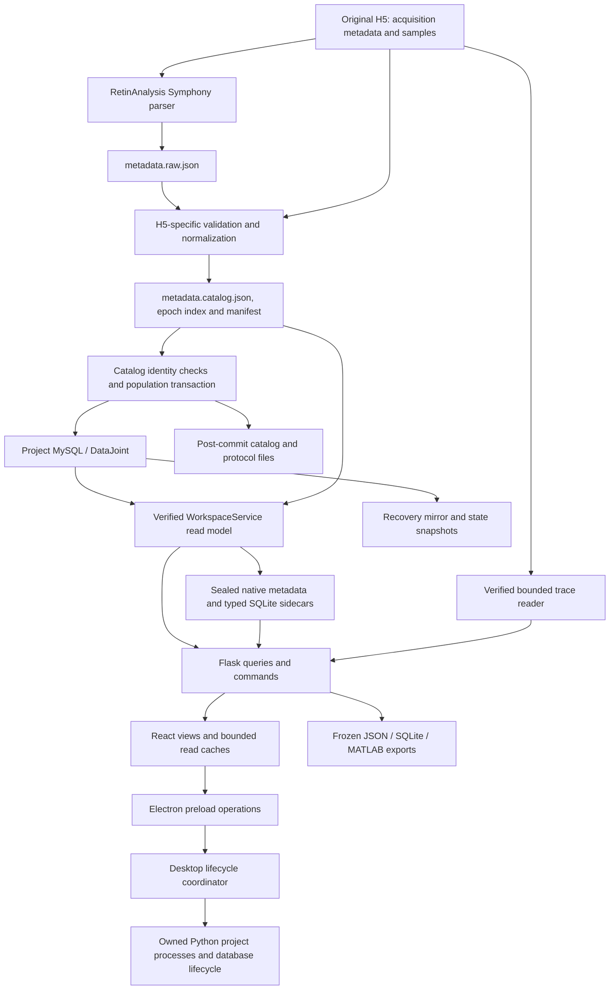

# Disco architecture

Disco is a local scientific application for inspecting, selecting, comparing and
exporting electrophysiology recordings. Its architecture must let implementations
change repeatedly for performance and user experience without changing scientific
meaning or forcing unrelated callers to be rewritten.

This entry point describes implemented boundaries at audited application commit
`fa7ed3e913903dec260e6cb1427120139996ffc1` (2026-10-04). The separate
[stable behavioral ports proposal](docs/architecture/stable-ports.md) defines
candidate interfaces, ownership, conformance evidence and an incremental adoption
plan. **The complete proposed ports remain design guidance.** Three bounded internal
[0.1.8 slices](docs/architecture/0.1.8-first-port-slices.md) now implement tree
selection reads, mutation recovery completion and export format materialization; that record identifies the
actual interfaces, preserved behavior, exact correctness evidence and limits.
The same record adopts existing P07 lifecycle obligations for scoped desktop
contract enforcement, without adding a runtime facade. It also records the bounded
presentation-session owner, which removes storage policy from App while preserving
navigation, draft and merge-consent ownership.

The [adopted-slice check catalog](docs/architecture/adopted-port-checks.json)
indexes owned dependencies and existing conformance tests. The
[operational checks](docs/architecture/0.1.8-first-port-slices.md#operational-architecture-checks)
explain commands, CI coverage and the remaining review obligations. The catalog
is an executable index, not a second behavioral contract.

The [core module ledger](docs/architecture/core-module-ledger.md) records completed
work, proposals, replacement options and explicitly unmeasured whole-app costs.

## Start here

- [Domain vocabulary](CONTEXT.md): recorded identity, protocol workspace, source
  revision, selection, inclusion, review and annotations are distinct concepts.
- [Application/distribution boundary](docs/RIEKE_OS_ARCHITECTURE.md): Disco,
  RetinAnalysis and the separate EpicTreeGUI application.
- [Port catalog and compatibility rules](docs/architecture/stable-ports.md#proposed-port-catalog):
  acquisition intake, catalog queries, tree reads, annotations, exports, traces,
  and project start/stop.
- [Selection state](docs/SELECTION_STATE_ARCHITECTURE.md) and
  [storage/recovery](docs/STORAGE_RECOVERY.md): persisted scientific decisions and
  recovery ownership.
- [Fixed benchmark protocol](docs/dev/benchmarks.md) and
  [registry](benchmarks/registry.json): evidence requirements and open gates.

## Implemented system

Arrows represent data flow or control, not all imports. The desktop coordinator
also owns windows, startup, update and shutdown recovery. Browser/source operation
has its own launcher composition. Exported SQLite files and recovery snapshots
have different authority and lifecycle from disposable SQLite query sidecars.

| Area | Current implementation | Authority / boundary |
| --- | --- | --- |
| H5 ingestion | [recording_workspace](python/recording_workspace.py), [import API](python/workspace_api.py), [managed recordings](python/workspace_recording_files.py) | Verify raw source and parsed hierarchy before population; report catalog commit separately from finalization. |
| Canonical catalog | RetinAnalysis acquisition schema, [workspace tables](python/recording_workspace.py), [curation](python/workspace_curation.py), [annotations](python/workspace_annotations.py), [explorer/bindings](python/workspace_explorer.py) | MySQL stores project registrations and authored state; original H5 retains samples. Sealed imported metadata is checked against registered manifests. |
| Metadata read model | [WorkspaceService](python/workspace_service.py), [disk index](python/workspace_disk_index.py), [metadata objects](python/workspace_metadata_objects.py) | Source identity and eligibility, exact rows/details, immutable generations and bounded caches. |
| Typed filtering / aggregates | [typed index](python/workspace_typed_index.py), [typed query](python/workspace_typed_query.py), [lifecycle](python/workspace_typed_lifecycle.py), [explore queries](python/workspace_explore_queries.py) | Derived SQLite accelerates supported reads; service adapters retain source, annotation and frozen-binding authority. |
| Tree navigation | [selection reader](workspace-app/src/treeSelectionReader.js), [tree semantics](python/workspace_tree.py), [tree pages](python/workspace_tree_pages.py), [ColumnTree](workspace-app/src/components/ColumnTree.jsx), [branch cache](workspace-app/src/treeBranchReadCache.js) | Exact typed grouping/order and revision-checked bounded pages; narrow attested ancestor reuse. |
| Scientific decisions | [shared annotations](python/workspace_annotations.py), [curation](python/workspace_curation.py), [workbench](python/workspace_workbench.py), [state generation](python/workspace_state_generation.py) | Author/scope/identity and expected revisions; transactionally related audit and generation. |
| Exports | [format materializer](python/workspace_export_artifacts.py), [recipes](python/workspace_recipes.py), [SQLite writer](python/workspace_sqlite.py), [standalone reader](python/query_workspace_export.py), [MATLAB writer](python/workspace_matlab.py) | Caller-owned frozen membership, metadata, source references, decisions and provenance; shared format tail retains caller publication authority. |
| Recovery | [HTTP completion policy](python/workspace_mutation_outcomes.py), [recovery store](python/workspace_recovery_store.py), [state snapshots](python/workspace_state_snapshot.py), [backup scheduler](python/workspace_backup_scheduler.py) | Backup completion is separate from an already committed native write. |
| Display and lifecycle | [API client/hooks](workspace-app/src/api.js), [renderer lifecycle](workspace-app/src/desktopLifecycle.js), [preload](desktop/preload.cjs), [supervisor](desktop/supervisor.cjs), [Python desktop](python/workspace_desktop.py) | Intent/publication fences, project/actor isolation, narrow IPC, process ownership, readiness, draft and close barriers. |

### The actual H5 and JSON boundary

`prepare()` invokes `Symphony2Reader.read_write(datajoint=True)` to create
`metadata.raw.json`, verifies and normalizes it against the source H5, writes
`metadata.catalog.json`, and records an epoch index plus a manifest.
`import_catalog()` then calls RetinAnalysis population under native identity checks
and a transaction. Post-commit files and protocol registration have separate
failure handling. This is an H5-to-JSON-to-database path, but the intermediate JSON
is RetinAnalysis-shaped and H5-dependent; it is not a generic JSON import API.

The [metadata bundle handoff](contracts/metadata-bundle/v1-draft/README.md) is an
**offline reviewed draft**. Production import of that bundle, generalized
metadata-only registration and full-field query fallback are not implemented by
this documentation. Authored-tag and selection-mask JSON are separate existing
interchange formats, not acquisition import adapters.

### Existing contracts to reuse

- [Typed query core](docs/dev/TYPED_QUERY_CORE_API.md): reader methods, conjunctive
  scope, thread/lease ownership, exact DTOs, cancellation and native adapters.
- [Typed service](docs/dev/TYPED_SERVICE_API.md): field registry, asynchronous
  summaries, bounded pages, cursor/generation fences and compatibility limits.
- [Tree query reuse](docs/dev/017-tree-query-reuse.md): narrow ancestor caching;
  its historical React version and test counts describe that slice, not current
  dependency versions or fresh qualification.
- [Import progress/recovery](docs/dev/IMPORT_PROGRESS_AND_RECOVERY.md),
  [explicit quit](docs/dev/DESKTOP_QUIT_COORDINATION.md), and
  [incoming workbench](docs/dev/incoming-workbench-contract.md).

These documents contain historical evidence as well as contracts. Confirm claims
against the relevant implementation revision. At this audit, the frontend pins
React 19.3.0 and TanStack Query 5.104.1. Current desktop startup defers parser/MySQL
initialization in the chooser and performs it for project children; full artifact
verification is handled at packaging/install/update or explicit verification,
separately from project/source readiness. Older experiment notes do not override
current source behavior.

## Direction for future changes

Keep the local application and existing storage stack. Move implementation
knowledge behind small use-case interfaces one boundary at a time. Views should
not acquire knowledge of SQL layouts, cache witnesses or parser classes when an
implementation changes. Conversely, a genuinely new scientific capability may
need an explicit contract evolution; do not freeze inadequate interfaces forever.

The [detailed proposal](docs/architecture/stable-ports.md) records the first
candidate, the deletion test, configuration ownership, implementation-versus-contract
versioning, reusable correctness/benchmark evidence, and migration decisions. It
is intended for discussion and incremental adoption, not a broad refactor mandate.
