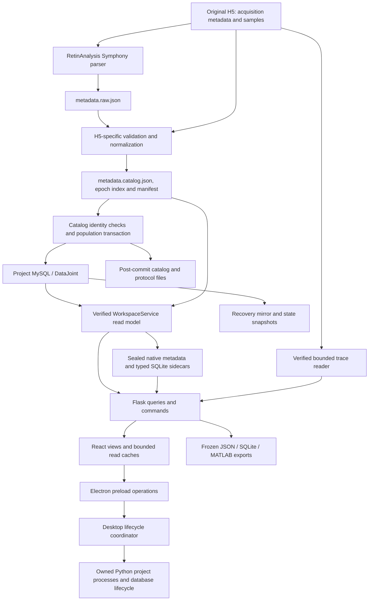

# Disco architecture

For public contracts and tests, use the [module guide](#module-guide) below and the
[frontend](workspace-app/src/AGENTS.md), [backend](python/AGENTS.md) or
[desktop](desktop/AGENTS.md) navigation for the owner you are changing.

Disco is a local scientific application for inspecting, selecting, comparing and
exporting electrophysiology recordings. Its architecture must let implementations
change repeatedly for performance and user experience without changing scientific
meaning or forcing unrelated callers to be rewritten.

This entry point describes the combined 0.1.8 source at the
[`7992957`](https://github.com/maxwellsdm1867/Rieke-OS/commit/7992957df574335a983b847ca1b5740c33ca486f)
main checkpoint (2026-10-05), including the module organization and subsequent
startup, navigation, trace and Workbench changes. The downloadable testing app was
built from clean source `60f9567ced676bf6c1db181166f2693304592768`; the later
checkpoint adds documentation and end-to-end checks. See the
[package record](docs/dev/local-package-0.1.8.json) for exact artifact identity and
[package history](docs/dev/navigation-package.md) for evidence and limitations.

The separate [stable behavioral ports proposal](docs/architecture/stable-ports.md)
defines candidate interfaces and an incremental adoption plan. **The complete
proposed ports remain design guidance.** The adopted
[0.1.8 slices](docs/architecture/0.1.8-first-port-slices.md) implement tree-selection
reads, mutation-recovery completion and export-format materialization, with later
group-save and presentation-session owners. Existing P07 desktop lifecycle
obligations are enforced without adding a new runtime facade. That adoption record
owns cross-module obligations; folder-local contracts describe the actual entries.

The [adopted-slice check catalog](docs/architecture/adopted-port-checks.json)
indexes owned dependencies and existing conformance tests. The
[operational checks](docs/architecture/0.1.8-first-port-slices.md#operational-architecture-checks)
explain commands, CI coverage and the remaining review obligations. The catalog
is an executable index, not a second behavioral contract.

The [core module ledger](docs/architecture/core-module-ledger.md) records completed
work, proposals, replacement options and explicitly unmeasured whole-app costs.

## Start here

- [Domain vocabulary](CONTEXT.md): recorded identity, protocol workspace, source
  revision, selection, inclusion, review and annotations are distinct concepts.
- [Application/distribution boundary](docs/RIEKE_OS_ARCHITECTURE.md): Disco,
  RetinAnalysis and the separate EpicTreeGUI application.
- [Port catalog and compatibility rules](docs/architecture/stable-ports.md#proposed-port-catalog):
  acquisition intake, catalog queries, tree reads, annotations, exports, traces,
  and project start/stop.
- [Selection state](docs/SELECTION_STATE_ARCHITECTURE.md) and
  [storage/recovery](docs/STORAGE_RECOVERY.md): persisted scientific decisions and
  recovery ownership.
- [Fixed benchmark protocol](docs/dev/benchmarks.md) and
  [registry](benchmarks/registry.json): evidence requirements and open gates.

## Deep modules in the current source

A **module** combines an interface with an implementation. Its **interface** includes
identity, ordering, errors, freshness, lifetime and performance obligations as well
as callable methods. **Depth** means substantial behavior behind a small interface:
callers gain leverage and maintainers gain locality. Tests should exercise the same
public seam as callers, with retained composition tests checking the surrounding
workflow. Moving files alone does not add depth.

| Implemented module and public seam | Behavior hidden from callers | Ownership kept outside |
| --- | --- | --- |
| [Tree selection](workspace-app/src/tree-selection/AGENTS.md): `createTreeSelectionReader` → `firstEpoch`, `rangeEpochIds` | Exact route selection, ordered traversal, bounded range paging and refusal of incomplete/stale ranges. | Views own gestures, cancellation and final selection publication. |
| [Presentation sessions](workspace-app/src/presentation/AGENTS.md): `remember`, `read`, `checkpoint`, `restore`, `pruneDeleted` | Route snapshots, destination fallbacks, checkpoint replacement and deletion pruning. | App owns navigation validation, persistence and project lifetime; restored presentation grants no scientific consent. |
| [Group-save sessions](workspace-app/src/group-save/AGENTS.md): `createGroupSaveSession`, recovery and receipt entries | Exact request retention, retry identity, uncertain-result recovery and deferred preview release. | Callers own preview validation and UI/undo publication; backend frozen membership remains authoritative. |
| [Mutation recovery](python/disco/recovery/CONTRACT.md): `register_mutation_recovery` | HTTP completion policy, backup-status reporting and committed-write/failed-backup translation. | Callers own transactions and scheduler lifetime; backup failure cannot imply rollback. |
| [Export materialization](python/workspace_export_artifacts.py): `materialize_export_format` | Shared JSON, full/linked SQLite and MATLAB format dispatch and artifact construction. | Callers own frozen membership, staging, validation and publication. |

Other organized folders retain substantive named entries rather than introducing
aggregate facades. In particular, metadata readers, query generations, trace
geometry, resource caches, desktop startup and close coordination keep their distinct
interfaces and lifetimes. Backend package initializers are inert except for the
explicit public recovery entry. Import the entry named in its local guide.

App, HTTP/service composition, source-verified recording access and several project
process/CLI owners remain at their established paths. The
[backend retained-owner decisions](python/AGENTS.md) explain why physical paths,
source witnesses and scientific authority prevent treating every move as mechanical.
Generic acquisition intake, a universal storage facade and the complete proposed
port catalog are not implemented by this organization.

## Module guide

Use this index to find the current physical owner before editing. Each linked
folder guide is the canonical local contract: how to call its public entries,
what it owns, dependencies, errors, lifetime rules, executable examples and tests.
The adoption record adds cross-owner obligations; it does not replace those local
contracts. The finite frontend A/B/C and backend moves are composed. Their ledger
entries preserve the scope and pending checks of those historical increments;
subsequent source and package checks retain their own commit attribution in the
package record. Organization remains partial: the system table below describes
responsibilities, not a claim that every area is one completed deep module.

For named backend owners, retained composition and source-witness obligations, use
[backend navigation](python/AGENTS.md).

| Responsibility | Canonical local guide |
| --- | --- |
| HTTP mutation completion and independent backup status | [Mutation recovery](python/disco/recovery/CONTRACT.md) |
| Metadata readers and disposable generations | [Metadata](python/disco/metadata/CONTRACT.md) |
| Authored decisions and adjacent tag/query owners | [Decisions](python/disco/decisions/CONTRACT.md) and [adjacent decisions](python/disco/decisions/ADJACENT.md) |
| Current-state backup and mirror storage | [Backup](python/disco/backup/CONTRACT.md) |
| Bounded predicate and tree navigation | [Navigation](python/disco/navigation/CONTRACT.md) |
| Project storage, retention and provisioning | [Projects](python/disco/projects/CONTRACT.md) |
| Frozen recipes, review and export publication | [Workbench](python/disco/workbench/CONTRACT.md) |
| Presentation snapshots and route checkpoints | [Presentation sessions](workspace-app/src/presentation/AGENTS.md) |
| Ordered, bounded selection reads | [Tree selection](workspace-app/src/tree-selection/AGENTS.md) |
| Group-save retry identity and recovery | [Group save](workspace-app/src/group-save/AGENTS.md) |
| Renderer draft queue, recovery and React lifetime | [Renderer drafts](workspace-app/src/renderer-drafts/AGENTS.md) |
| Versioned tree-layout saves and load lifetime | [Protocol tree layout](workspace-app/src/protocol-tree-layout/AGENTS.md) |
| Route identity, history and navigation intent | [Workspace navigation](workspace-app/src/workspace-navigation/AGENTS.md) |
| Search activation, typed identity and bounded reuse | [Search activation](workspace-app/src/search-activation/AGENTS.md) |
| Requested-field jobs, scope witnesses and cancellation | [Requested summaries](workspace-app/src/requested-summaries/AGENTS.md) |
| Witnessed ancestor reuse and provider lifetime | [Attested tree ancestors](workspace-app/src/tree-ancestors/AGENTS.md) |
| Typed predicates, split recipes and editor lifetime | [Typed query presentation](workspace-app/src/typed-query/AGENTS.md) |
| Incoming queue, frozen review and distinct consent/command entries | [Incoming workbench](workspace-app/src/incoming-workbench/AGENTS.md) |
| Bounded trace geometry and scoped request identity | [Trace windows](workspace-app/src/traces/AGENTS.md) |
| Annotations | [Annotations](workspace-app/src/annotations/AGENTS.md) |
| App updates | [App updates](workspace-app/src/app-updates/AGENTS.md) |
| Appearance | [Appearance](workspace-app/src/appearance/AGENTS.md) |
| Cell qc | [Cell qc](workspace-app/src/cell-qc/AGENTS.md) |
| Epoch browser | [Epoch browser](workspace-app/src/epoch-browser/AGENTS.md) |
| Exports | [Exports](workspace-app/src/exports/AGENTS.md) |
| File picker | [File picker](workspace-app/src/file-picker/AGENTS.md) |
| Metadata explorer | [Metadata explorer](workspace-app/src/metadata-explorer/AGENTS.md) |
| Metadata refresh | [Metadata refresh](workspace-app/src/metadata-refresh/AGENTS.md) |
| Project preferences | [Project preferences](workspace-app/src/project-preferences/AGENTS.md) |
| Project workspace | [Project workspace](workspace-app/src/project-workspace/AGENTS.md) |
| Protocol overview | [Protocol overview](workspace-app/src/protocol-overview/AGENTS.md) |
| Recording import | [Recording import](workspace-app/src/recording-import/AGENTS.md) |
| Summary jobs | [Summary jobs](workspace-app/src/summary-jobs/AGENTS.md) |
| Tree browser | [Tree browser](workspace-app/src/tree-browser/AGENTS.md) |
| Undo | [Undo](workspace-app/src/undo/AGENTS.md) |
| Draft barriers and bounded ordinary Quit | [Desktop close](desktop/close/README.md) |
| Scoped persistent renderer drafts | [Desktop draft store](desktop/drafts/README.md) |
| Startup preference validation and one-time claim | [Desktop startup](desktop/startup/README.md) |
| Explicit application verification and recovery ordering | [Desktop integrity](desktop/integrity/README.md) |
| Signed and unsigned-testing update coordination | [Desktop updates](desktop/updates/README.md) |
| Retained installed helper and rollback paths | [Installation and rollback](desktop/INSTALLATION.md) |
| Retained supervisor, restoration, profile and location ownership | [Startup and state owners](desktop/RETAINED_OWNERS.md) |

[Frontend instructions](workspace-app/src/AGENTS.md),
[desktop instructions](desktop/AGENTS.md) and [retained tooling instructions](tools/AGENTS.md)
provide area-specific check commands and remaining owners. Mutation recovery uses
its public Python package; six further packages expose their existing named leaves
through inert initializers. Stable composition and CLI owners retain physical paths.
These source-level ownership checks do not establish assembled-app qualification.
See the [current path ledger](docs/architecture/core-module-paths.json)
for baseline versus current paths; historical evidence must retain its original
source identity. No folder-count or test result substitutes for native/package
acceptance or a measured performance comparison.

## Implemented system

Arrows represent data flow or control, not all imports. The desktop coordinator
also owns windows, startup, update and shutdown recovery. Browser/source operation
has its own launcher composition. Exported SQLite files and recovery snapshots
have different authority and lifecycle from disposable SQLite query sidecars.

| Area | Current implementation | Authority / seam |
| --- | --- | --- |
| H5 ingestion | [recording_workspace](python/recording_workspace.py), [import API](python/workspace_api.py), [managed recordings](python/disco/projects/recording_files.py) | Verify raw source and parsed hierarchy before population; report catalog commit separately from finalization. |
| Canonical catalog | RetinAnalysis acquisition schema, [workspace tables](python/recording_workspace.py), [curation](python/disco/decisions/curation.py), [annotations](python/disco/decisions/annotations.py), [explorer/bindings](python/disco/decisions/explorer.py) | MySQL stores project registrations and authored state; original H5 retains samples. Sealed imported metadata is checked against registered manifests. |
| Metadata read model | [WorkspaceService](python/workspace_service.py), [disk index](python/disco/metadata/disk_index.py), [metadata objects](python/disco/metadata/metadata_objects.py) | Source identity and eligibility, exact rows/details, immutable generations and bounded caches. |
| Typed filtering / aggregates | [typed index](python/disco/metadata/typed_index.py), [typed query](python/disco/metadata/typed_query.py), [lifecycle](python/disco/metadata/typed_lifecycle.py), [explore queries](python/disco/metadata/explore_queries.py) | Derived SQLite accelerates supported reads; service adapters retain source, annotation and frozen-binding authority. |
| Tree navigation | [selection reader](workspace-app/src/tree-selection/treeSelectionReader.js), [tree semantics](python/disco/navigation/tree.py), [tree pages](python/disco/navigation/tree_pages.py), [ColumnTree](workspace-app/src/tree-browser/ui/ColumnTree.jsx), [branch cache](workspace-app/src/tree-ancestors/treeBranchReadCache.js) | Exact typed grouping/order and revision-checked bounded pages; narrow attested ancestor reuse. |
| Scientific decisions | [shared annotations](python/disco/decisions/annotations.py), [curation](python/disco/decisions/curation.py), [workbench](python/disco/workbench/workbench.py), [state generation](python/workspace_state_generation.py) | Author/scope/identity and expected revisions; transactionally related audit and generation. |
| Linked SQLite and shared recording ownership | [Contract and standalone loader](docs/architecture/linked-sqlite-managed-recordings.md) | Frozen membership and groups; verified existing metadata/H5 references; SHA-based managed-file reuse with protected consumers. |
| Exports | [format materializer](python/workspace_export_artifacts.py), [recipes](python/disco/workbench/recipes.py), [SQLite writer](python/workspace_sqlite.py), [standalone reader](python/query_workspace_export.py), [MATLAB writer](python/workspace_matlab.py) | Caller-owned frozen membership, metadata, source references, decisions and provenance; shared format tail retains caller publication authority. |
| Recovery | [HTTP completion policy](python/disco/recovery/__init__.py), [recovery store](python/disco/backup/recovery_store.py), [state snapshots](python/workspace_state_snapshot.py), [backup scheduler](python/disco/backup/backup_scheduler.py) | Backup completion is separate from an already committed native write. |
| Display and lifecycle | [API client/hooks](workspace-app/src/api.js), [renderer lifecycle](workspace-app/src/desktopLifecycle.js), [preload](desktop/preload.cjs), [supervisor](desktop/supervisor.cjs), [Python desktop](python/workspace_desktop.py) | Intent/publication fences, project/actor isolation, narrow IPC, process ownership, readiness, draft and close barriers. |

### The actual H5 and JSON boundary

`prepare()` invokes `Symphony2Reader.read_write(datajoint=True)` to create
`metadata.raw.json`, verifies and normalizes it against the source H5, writes
`metadata.catalog.json`, and records an epoch index plus a manifest.
`import_catalog()` then calls RetinAnalysis population under native identity checks
and a transaction. Post-commit files and protocol registration have separate
failure handling. This is an H5-to-JSON-to-database path, but the intermediate JSON
is RetinAnalysis-shaped and H5-dependent; it is not a generic JSON import API.

The [metadata bundle handoff](contracts/metadata-bundle/v1-draft/README.md) is an
**offline reviewed draft**. Production import of that bundle, generalized
metadata-only registration and full-field query fallback are not implemented by
this documentation. Authored-tag and selection-mask JSON are separate existing
interchange formats, not acquisition import adapters.

### Existing contracts to reuse

- [Typed query core](docs/dev/TYPED_QUERY_CORE_API.md): reader methods, conjunctive
  scope, thread/lease ownership, exact DTOs, cancellation and native adapters.
- [Typed service](docs/dev/TYPED_SERVICE_API.md): field registry, asynchronous
  summaries, bounded pages, cursor/generation fences and compatibility limits.
- [Tree query reuse](docs/dev/017-tree-query-reuse.md): narrow ancestor caching;
  its historical React version and test counts describe that slice, not current
  dependency versions or fresh qualification.
- [Import progress/recovery](docs/dev/IMPORT_PROGRESS_AND_RECOVERY.md),
  [explicit quit](docs/dev/DESKTOP_QUIT_COORDINATION.md), and
  [incoming workbench](docs/dev/incoming-workbench-contract.md).

These documents contain historical evidence as well as contracts. Confirm claims
against the relevant implementation revision. At the combined-source checkpoint,
the frontend pins React 19.3.0 and TanStack Query 5.104.1. Current desktop startup defers parser/MySQL
initialization in the chooser and performs it for project children; full artifact
verification is handled at packaging/install/update or explicit verification,
separately from project/source readiness. Older experiment notes do not override
current source behavior.

## Current startup, browsing and Workbench composition

- **Startup and shutdown:** the desktop main process claims the remembered project
  after authenticated root readiness and uses the existing restore/authorization
  path for the first application document. Chooser startup defers parser/MySQL
  activation to project children. Startup preference does not establish readiness;
  draft barriers, process ownership and bounded ordinary Quit retain their owners.
- **Epochs and traces:** the shared Inspector/Workbench list appends bounded pages,
  retains a keyboard Load more fallback and restores frontiers sequentially. Rows
  retain exact page receipts. Traces appear beside terminal epochs; bounded workers
  perform the existing source-verified reads and exit before database cleanup.
  [Trace presentation](workspace-app/src/traces/AGENTS.md) keeps its geometry and
  scoped request identity separate from shared cache lifetime.
- **Tree browsing:** paged columns and hierarchy request group totals and epoch
  counts, skipping full-bucket duration, distinct-cell and shared-tag-coverage scans.
  Frozen columns use one advertised fresh batch for the target and bounded ancestors;
  frozen candidate cache reuse remains disabled. Full field metadata is deferred
  until a split chooser opens. These read optimizations preserve revision, membership
  and closing-authority checks. See [tree presentation](workspace-app/src/tree-browser/AGENTS.md)
  and [backend navigation](python/disco/navigation/CONTRACT.md).
- **Workbench and layout:** incoming review prepares independently of the main
  protocol summary and saved main-tree layout. A refresh reuses its verified catalog
  connection and read-only schema attestation; mutations retain their transaction
  and backup checks. Candidate replacement may preserve inert browsing mode/focus,
  without copying selections or consent. Arrange tree cards own layout; branch and
  epoch controls own selection/tag actions. Selected UUIDs remain action authority.
  See [incoming review](workspace-app/src/incoming-workbench/AGENTS.md) and
  [backend Workbench](python/disco/workbench/CONTRACT.md).

The [navigation package history](docs/dev/navigation-package.md) records the exact
source checks, small-fixture timing observations and packaged smoke/workflow runs.
Earlier measurements are not relabeled as later-source results. The 0.1.8 testing
artifact is unsigned, for Apple silicon, and exercised on macOS 27.0.1. Intel is
unsupported; macOS 14 runtime support and full release qualification remain open.

## Direction for future changes

Keep the local application and existing storage stack. Move implementation
knowledge behind small use-case interfaces one seam at a time. Views should
not acquire knowledge of SQL layouts, cache witnesses or parser classes when an
implementation changes. A new scientific capability may
need an explicit contract evolution; do not freeze inadequate interfaces forever.

The [detailed proposal](docs/architecture/stable-ports.md) records the first
candidate, the deletion test, configuration ownership, implementation-versus-contract
versioning, reusable correctness/benchmark evidence, and migration decisions. It
is intended for discussion and incremental adoption, not a broad refactor mandate.

Desktop close coordination lives in [desktop navigation](desktop/AGENTS.md) and
[its public contracts and examples](desktop/close/README.md). Electron composition
remains in main; strict replacement and bounded explicit Quit stay distinct.
