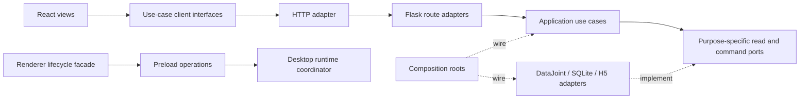

# Stable behavioral ports for evolving Disco implementations

**Status: proposed architecture, not an implementation or approved refactor.**
Audited application baseline: `fa7ed3e913903dec260e6cb1427120139996ffc1`, verified
against GitHub `main` on 2026-10-04. This document changes no runtime contract.
Port IDs below are documentation labels, not published protocol versions or
new Python/JavaScript symbols. See [ARCHITECTURE.md](../../ARCHITECTURE.md) for
the current module map and existing contract documents.

## Goal and design rule

Disco's internal query, cache, ingestion and presentation implementations will
change repeatedly to improve user experience and performance. The goal is to make
those replacements local while preserving scientific behavior. More files,
interfaces or services are not the objective.

A stable port defines inputs, outputs, meaning, ordering, errors/cancellation,
freshness authority, side effects, ownership/lifetime and resource obligations.
Matching JSON shape alone is insufficient. A candidate boundary earns its cost
when removing it would force callers to reimplement its hidden complexity; a
pass-through wrapper exposing the entire `WorkspaceService` does not help.

Use a small number of purpose-specific ports. Keep MySQL/DataJoint, disposable
SQLite indexes, H5 and React/Electron adapters in this application. Ordinary
constructor/function arguments can select implementations; no injection container,
microservices, universal CRUD repository or plugin registry is proposed.

## Facts that constrain the design

### Useful seams already exist

- [TypedMetadataIndex](../../python/workspace_typed_index.py) exposes bounded
  pages, exact membership, detail and requested summaries. Its
  [core contract](../dev/TYPED_QUERY_CORE_API.md) distinguishes a native reader
  from a service adapter's source/annotation/binding authority.
- [Metadata object encoding](../../python/workspace_metadata_objects.py) hides
  lossless ancestor deduplication and verifies ownership and content.
- `read_response_window()` in [workspace_service](../../python/workspace_service.py)
  is shared by live reads and the [standalone export reader](../../python/query_workspace_export.py).
- The [preload bridge](../../desktop/preload.cjs) exposes named operations with
  `protocolVersion: 1`, rather than arbitrary renderer IPC access.
- [Independent qualification tooling](../../tools/metadata_qualification/README.md)
  has a source oracle separate from optimized predicate/SQL implementation.

Preserve these mechanisms and their tests. A module is not shallow merely because
it is small, and a large module is not automatically wrong.

### Concrete implementation leakage

| Boundary | Evidence at the audited baseline | Consequence for replacement |
| --- | --- | --- |
| Tree reader → broad service | `TreePages._scope()` reads `service.rows`, `_fingerprints`, `protocols`, indexes and private cache fields; `_structural_contract()` recognizes exact `WorkspaceService` and `ExplorerHistory` methods in [tree pages](../../python/workspace_tree_pages.py). | A harmless internal refactor can change acceleration eligibility. These guards currently protect custom policies; removing them would be unsafe. |
| Renderer → tree protocol | [PagedTree](../../workspace-app/src/components/PagedTree.jsx) chooses normal versus frozen-context endpoints, follows branches and does 60-row range arithmetic. [Request construction](../../workspace-app/src/pagedTreeRequest.js) and [cache admission](../../workspace-app/src/treeBranchReadCache.js) share page assumptions. | Routing or pagination changes reach views, helpers and caches. |
| Transport → commands/lifecycle | [api.js](../../workspace-app/src/api.js) contains transport, undo, write barriers, hooks and formatting. The API's `backup_saved_state()` classifies read-only POST endpoints by name. | A new endpoint can accidentally inherit write/backup/close behavior; a nominal error may mean the database already committed. |
| Ingestion → parser/database | [recording_workspace](../../python/recording_workspace.py) loads a fixed RetinAnalysis parser path, traverses its hierarchy and invokes population with normalized JSON and H5 context. | A different source adapter cannot simply provide arbitrary JSON to current population. |
| Query/recovery consumers → native mechanisms | [annotations](../../python/workspace_annotations.py), [workbench](../../python/workspace_workbench.py), [QC](../../python/workspace_qc.py) and [protocol state](../../python/workspace_protocol_state.py) access service rows, fingerprints, native connection or private helpers. | Narrower readers may help, but replacing database semantics with generic CRUD would hide necessary transaction and identity capabilities. |

The last 40 commits touching Python, renderer or desktop code at this baseline
included seven touches each to `workspace_desktop.py` and `desktop/main.cjs`, five
to `ColumnTree.jsx`, and three to `workspace_tree_pages.py`. These bounded counts
indicate active change areas, not defect rates or performance evidence.

## Proposed dependency direction



Arrows here express dependency intent. Port definitions belong with the use cases
that need them. Composition roots select concrete adapters; domain policy should
not import Flask, React, DataJoint or Electron solely to decide scientific meaning.
Existing assembly in `create_app()` is a starting point, not something to replace
all at once. Helpers can remain plain functions when they already hide enough.

## Proposed port catalog

Each entry records a **candidate** interface and the actual current owners. No
implementation is newly certified to satisfy it by publishing this document.
Error names below are semantic categories, not invented existing wire codes.
Existing endpoint status/payload/error behavior remains governed by its current
implementation and linked contract until intentionally evolved.

### P01 — Acquisition intake and catalog apply

**Maturity:** source-specific H5 behavior exists; the generalized JSON/domain
contract still needs agreement. Do not assume the reviewed bundle schema is a
production input API.

- **Responsibility:** prepare source metadata, validate scientific identity and
  completeness, apply conflicts and registrations, and report each commit stage.
- **Input:** source descriptor and adapter/version, owning project, cancellation
  and progress context; for apply, a validated candidate plus expected catalog
  state. A candidate must bind exact source revision, entity IDs/ancestry, typed
  values, units/missingness/provenance, stream descriptions, raw claims, and
  coverage diagnostics. A public `verified` flag cannot grant raw authority.
- **Output:** proposed phases `prepare → validate → apply → status`; diagnostic
  candidate/validation result, then a receipt distinguishing catalog commit from
  protocol/file publication and recovery. Full membership/data may require
  bounded iteration rather than a large in-memory DTO.
- **Errors:** unsupported or unmapped data, incomplete coverage, source changed,
  identity/name/ancestry conflict, invalid unit/type, cancellation, unknown commit,
  committed but finalization failed. Never turn failure into empty success.
- **Owner/lifetime/freshness:** the source adapter owns extraction and source proof;
  ingestion owns temporary artifacts, conflict checks, native transaction and
  finalization. Recheck catalog conflicts when applying; parsed cache validity
  binds source and parser provenance. Cancellation before commit and a lost
  response after commit are different outcomes.
- **Current implementation:** `prepare()` and `import_catalog()` in
  [recording_workspace](../../python/recording_workspace.py),
  [API import jobs](../../python/workspace_api.py),
  [recording files](../../python/workspace_recording_files.py),
  [identity/collision checks](../../python/workspace_catalog_identity.py).
- **Reusable conformance:** source mutation, empty ancestry branches, type/unit
  preservation, duplicate versus different-source identity conflicts, transaction
  failure and post-commit failure. When JSON exists, compare H5 and JSON candidates
  only for facts both actually claim; do not manufacture missing raw/provenance.
- **Benchmarks:** parse/validate/apply separately; epochs and relationships per
  second, staging disk/RSS, and raw verification costs. Existing native ingest
  qualification gaps remain open.

Actual current path:

```text
H5 → Symphony2Reader.read_write(datajoint=True) → metadata.raw.json
   → validate/normalize against H5 → metadata.catalog.json
   + epoch-index.json + import-manifest.json
   → identity/conflict checks + RetinAnalysis population → MySQL commit
   → catalog/protocol files and final status
```

Proposed common seam, when a second format is authorized:

```text
H5 extraction/verification ─┐
                           ├→ acquisition candidate → shared semantic validation
JSON adapter (future) ······┘                       → catalog apply → stage receipt
raw attachment claims → independent verified resolver (not candidate self-attestation)
```

The [draft bundle](../../contracts/metadata-bundle/v1-draft/README.md) has distinct
missingness rules and unresolved complete-field coverage. Metadata-only sources
require explicit storage/version design; never use a JSON hash in the current
H5 Source key. The current experiment-name collision guard exists because
RetinAnalysis consumers still select by filename-derived name. Removing it is a
consumer compatibility change, not an “allow duplicates” configuration option.

### P02 — Catalog query snapshot

**Maturity:** query semantics are established; universal field coverage and a
unified snapshot interface are not fully implemented.

- **Responsibility:** expose exact typed detail, field definitions, membership,
  bounded pages and requested aggregates independently of index strategy.
- **Input:** owning project, validated predicate, conjunctive structural/source
  scope, protocol-workspace binding when applicable, requested fields, expected
  generation and continuation. Acquisition protocol name is not workspace UUID.
- **Output:** exact typed DTOs; ordered pages and opaque continuation; independent
  counts/requested summaries; scoped generation and coverage/completeness where
  supported. A core rank integer is not a public cursor. Membership can be a
  bounded iterator; do not force materialization into a universal result object.
- **Errors:** invalid predicate/scope/cursor, stale generation, unavailable or
  corrupt source/index, unsupported/incomplete coverage, capacity and explicit
  cancellation. Proposed completeness reporting must not be mistaken for a
  currently implemented full-field fallback.
- **Owner/lifetime/freshness:** query owner retains verified native/typed leases;
  each typed worker uses its own thread-confined SQLite reader. Do not interleave
  another query on a reader while its membership iterator is active. Service
  adapters own eligible sources, frozen bindings and annotations; check authority
  before publication. New-source exclusion and frozen-protocol membership differ.
- **Current owners/contracts:** [WorkspaceService](../../python/workspace_service.py),
  [typed lifecycle](../../python/workspace_typed_lifecycle.py),
  [typed core contract](../dev/TYPED_QUERY_CORE_API.md),
  [service contract](../dev/TYPED_SERVICE_API.md). Existing async summaries expose
  pending/ready/cancelled/stale/failed and only ready publishes results.
- **Reusable conformance:** independent truth for types/null/missing, all predicate
  operators, exact scoped membership, every continuation, empty scopes, corrupt
  seals, changed generations and cancellation; general/native versus typed parity.
- **Benchmarks:** first/warm detail and page, deep pages, membership, requested
  facets, retained disk/RSS, initialization, rebuild and cleanup. Keep exact count,
  first page and summaries separate; do not charge hidden precomputation elsewhere.

### P03 — Tree read session

**Maturity:** strongest first candidate; established semantics with dispersed
routing, lifetime and optimization policy.

- **Responsibility:** one frontend session and one backend reader hide route/page
  mechanics, scoped tree membership and safe ancestor reuse.
- **Input:** explicit source kind/context (normal protocol versus frozen workbench
  must remain distinct), validated filters/predicate, split order, opaque path or
  anchor, expected revision, offset/limit and cancellation/intent context.
- **Output:** ordered bounded branch or epoch page, summaries, continuation,
  revision and optional backend read attestation. Range resolution stays within
  one exact branch/revision; selection state remains owned by the UI.
- **Errors:** invalid scope/path/split, revision conflict, absent/expired proof,
  capacity, transport failure or cancellation. Absence of acceleration proof can
  fall back to a fresh canonical read; it does not license stale reuse.
- **Owner/lifetime/freshness:** frontend owns intent, actor/project activation and
  lease retirement; backend owns membership, binding and generation. Current
  optimization obtains a fresh target/anchor and only reuses qualifying
  nonterminal ancestors. Terminal rows, frozen/filtered/annotation scopes and
  action preparation are outside that reusable cache. Retained UI is inert until
  validated. A read lease never authorizes a mutation.
- **Current owners:** [TreePages](../../python/workspace_tree_pages.py),
  [tree semantics](../../python/workspace_tree.py),
  [PagedTree](../../workspace-app/src/components/PagedTree.jsx),
  [ColumnTree](../../workspace-app/src/components/ColumnTree.jsx),
  [branch cache](../../workspace-app/src/treeBranchReadCache.js),
  [retained presentation](../../workspace-app/src/components/RetainedTreePresentation.jsx).
- **Reusable conformance:** complete page/branch/anchor/range equivalence against
  canonical semantics; stale binding, same-membership annotation edit, restart,
  actor/project switch, hidden view and out-of-order success/error; custom-policy
  fallback and bounded allocation. Preserve the current method-identity guards
  until trusted snapshot production has equivalent evidence.
- **Benchmarks:** first/return target-to-page and render milestones, server time,
  actual request counts, in-flight work, cache admission and retained bytes. Exact
  canonical sorting and typed-filter implementation changes share this suite.

```text
Before: views → route/body/page arithmetic + cache/witness/intent details
        TreePages → broad service internals + exact-method recognition

After:  views → TreeReadSession (open/page/range/retire: proposed operations)
             → tree-reader use case → current native service adapter
                                    → scoped snapshot/authority producer (later)
```

First wrap existing behavior. Later a trusted snapshot producer may hide rows and
indexes while carrying policy, binding and generations. A caller-provided
`supportsFastPath=true` flag cannot replace proof. If deleting a cache/SQL adapter
still requires changing views, the extraction has not yet established the port.

### P04 — Annotation and curation commands

**Maturity:** established ownership/revision semantics; common outcome vocabulary
and policy registration are proposed.

- **Responsibility:** apply scientific decisions to exact identities, preserve
  audit/undo and make persistence stages explicit.
- **Input:** owning project, author/profile, shared-cell/shared-epoch or
  protocol-curation scope, exact targets, changes, expected per-target revisions
  and fingerprints/binding as required. Operation IDs apply only where the
  operation currently implements durable replay.
- **Output:** changed revisions, audit/undo/operation receipt as appropriate,
  database commit state and independent backup/recovery state.
- **Errors:** stale revision or binding, invalid target/ownership, validation
  failure, unknown outcome, committed with degraded recovery. Never infer rollback
  from HTTP cancellation or blindly retry a write after connection loss.
- **Owner/lifetime/freshness:** command owner controls transaction, lock order,
  expected-state checks and audit. Native generation changes remain tied to writes.
  Recovery scheduler owns independent mirrors; close/update coordinates flush.
  Shared cell inheritance is not copied per epoch; curation stays workspace-scoped.
- **Current owners:** [annotations](../../python/workspace_annotations.py),
  [curation](../../python/workspace_curation.py),
  [group receipts](../../python/workspace_annotation_groups.py),
  [state generation](../../python/workspace_state_generation.py),
  [backup scheduler](../../python/workspace_backup_scheduler.py),
  [undo](../../workspace-app/src/mutationUndo.js).
- **Reusable conformance:** native rollback/concurrency, exact authors/targets,
  inheritance, stale all-or-nothing batches, undo and operation replay where
  supported, SQL commit followed by failed backup, and close-barrier reporting.
- **Benchmarks:** bounded tag/curation batches, visible save acknowledgment and
  recovery lag separately; dense/native tag performance needs its own evidence.

Today, some successful annotation responses report committed database state with
pending backup; other successful mutations synchronously flush. A failed flush
can return HTTP 507 with `saved:true`. The general client infers writes from HTTP
verbs, while the server has a read-only POST exemption list. Proposed operation
policy belongs beside registration and must preserve these distinctions before
any wire redesign. Do not put a new generic transaction around every route or
move schema declarations inside data transactions.

### P05 — Frozen export

**Maturity:** stable purpose and identity; individual formats evolve.

- **Responsibility:** capture and publish an exact reproducible selection, separate
  from current view focus and later edits.
- **Input:** export scope and format, exact binding/selection, explicit review and
  inclusion policy, expected revisions, destination and actor/provenance context.
- **Output:** artifact/recipe receipt with exact membership, metadata/annotations,
  source references, checksums and recorded format/method versions. A frozen
  artifact is not a live query and an export is not a recovery snapshot.
- **Errors:** stale selection, incompatible protocol, invalid destination/format,
  missing or unverified raw inputs where required, publication/recovery failure,
  unknown outcome. Report whether the authoritative record committed.
- **Owner/lifetime/freshness:** export coordinator owns capture, artifact
  publication and audit; serializers own format details. Freeze checked inputs;
  preserve history and explicitly handle cross-database/filesystem failure.
- **Current owners:** [recipes](../../python/workspace_recipes.py),
  [candidate exports](../../python/workspace_candidate_exports.py),
  [SQLite export](../../python/workspace_sqlite.py),
  [standalone reader](../../python/query_workspace_export.py),
  [MATLAB export](../../python/workspace_matlab.py). Current SQLite writes schema
  v2; the reader accepts v1/v2. See [application boundary](../RIEKE_OS_ARCHITECTURE.md)
  for MATLAB data/reference semantics.
- **Reusable conformance:** independent format readers, exact source/member/value
  roundtrip, legacy reading, refusal of changed source, and post-commit/publication
  fault injection. No inferred stimulus reconstruction or fabricated waveforms.
- **Benchmarks:** size/time/RSS by format and selection scale; separate metadata,
  raw verification and waveform access rather than one misleading “export speed.”

### P06 — Verified trace window

**Maturity:** existing shared reader is already a useful small interface.

- **Responsibility:** return bounded full-rate samples from the exact verified
  source revision without loading waveforms during ordinary metadata navigation.
- **Input:** source revision/verification context, epoch and stream IDs, integer
  sample start/count. A filename or H5 locator alone is not source authority.
- **Output:** values, sample rate/units, total/start/count, epoch/stream IDs,
  source hash and `decimated:false` under current behavior.
- **Errors:** unavailable/changed source, wrong hash/identity/path/rate/unit/count,
  invalid window, nonfinite samples. No silent unit conversion or decimation.
- **Owner/lifetime/freshness:** raw resolver/reader owns source verification and
  session lifetime; signatures are rechecked around reads. A moved file can be
  rebound only after proving identical bytes. Future non-H5 adapters must supply
  equivalent evidence or declare an explicit capability/contract change.
- **Current owners:** `read_response_window()` in
  [workspace_service](../../python/workspace_service.py) and
  [ExportReader](../../python/query_workspace_export.py).
- **Reusable conformance:** analytic synthetic H5 oracle through both live and
  standalone paths, every boundary window, relocation, tampered data/identity and
  changed source during reads. Source scientific data remains untouched.
- **Benchmarks:** source verification versus first/warm window separately;
  bounded sample allocation and no eager waveform loading from metadata requests.

### P07 — Project runtime start/stop

**Maturity:** safety goals are established; one consumer facade and normalized
outcomes are proposed. Keep platform/process details behind adapters.

- **Responsibility:** start an owned project session, report authoritative
  readiness, coordinate close/update/explicit quit and preserve uncertain recovery.
- **Input:** project UUID/canonical path and runtime operation context; for stop,
  exact session identity, reason/mode and deadline. Strict project close/update
  and bounded explicit app quit must remain distinct operations or explicit modes.
- **Output:** session-bound status and readiness, progress/failure details,
  subscription cleanup, and stop result distinguishing confirmed clean exit,
  blocked operation and unconfirmed cleanup. Remembered views are preferences.
- **Errors:** component/startup failure, busy writers, cancelled startup, lost
  child, ownership mismatch, incomplete draft/backup and unconfirmed shutdown.
  Explicit app exit may finish with recovery retained; it is not proof that every
  owned process/database shut down cleanly.
- **Owner/lifetime/freshness:** Electron/Python coordinators own process/database
  leases and private capabilities; renderer facade requests operations and saves
  drafts. Readiness binds current project/session/process. Updates and strict
  close require positive drain/exit evidence; uncertain writers are not killed
  merely to manufacture a successful stop receipt.
- **Current owners:** [preload](../../desktop/preload.cjs),
  [supervisor](../../desktop/supervisor.cjs),
  [quit coordinator](../../desktop/quit-coordinator.cjs),
  [Python desktop](../../python/workspace_desktop.py),
  [renderer lifecycle](../../workspace-app/src/desktopLifecycle.js).
  [Explicit quit contract](../dev/DESKTOP_QUIT_COORDINATION.md) describes mode-specific
  deadlines, ownership checks and recovery.
- **Reusable conformance:** injected process/clock/status faults, cancellation,
  repeated quit, missing renderer acknowledgment, committed-but-unbacked writes,
  exact ownership and strict-close refusal; later owned native start/open/stop.
- **Benchmarks:** launch→usable chooser, project selection→authoritative data,
  first exact trace, and stop→zero owned processes/sockets separately. A visible
  window or restored DOM is not scientific readiness.

## Shared behavioral obligations

| Dimension | What must remain explicit |
| --- | --- |
| Typed data | False, zero, empty string, recorded null, missing and unloaded are distinct. Predicate numeric equality is not identical to canonical grouping identity. Preserve int/float and signed-zero behavior where the current operation distinguishes them. |
| Browser encoding | `ExactMetadataJSON` currently serializes integers outside ±(2^53−1) as strings. Do not introduce tagged numeric values or coercion as an unnoticed internal refactor. Python type hints do not validate a network payload. |
| Order | Canonical group keys, numeric tie-breaks, Unicode, joint-component ordering, chronology and UUID tie-breaks affect paging/anchors and must be tested. |
| Freshness | Renderer intent/activation, cache retention, lease expiry, tree revision, binding and native generation are different concepts. A TTL cannot replace scientific authority. |
| Authority | Metadata/typed/source/annotation/publication/binding witnesses are context-specific. Registry and scoped job tokens need not be identical; compare the token appropriate to that operation. Same membership can have a new annotation generation. |
| Cancellation | One subscriber leaving must not cancel another; retired work cannot publish even if transport ignores abort. Typed cancellation is an explicit failure, never an empty match. Cancellation of a write is not rollback. |
| Side effects | Expected-state checks, native writes and their immutable audit belong in the appropriate transaction. Filesystem publication and recovery have independent outcomes. Preserve schema declaration placement and lock order. |
| Performance | Bounded pages, work admission, retained bytes, reader leases and lazy details are part of substitutability. Avoid per-row transport, eager whole-catalog DTOs and new hot-loop runtime validation. |

### Complete metadata versus acceleration

Current `_leaves()` discovery in [workspace_tree](../../python/workspace_tree.py)
limits nested depth, arrays longer than 32 and serialized values over 1024
characters; descriptive metadata selects attributes. The typed field registry
inherits eligible discovery. Full detail retention and eligible-field parity do
not prove all fields are queryable.

The target is complete metadata access independent of acceleration tier, with
explicit coverage and bounded slower evaluation for unindexed fields. That target
is recorded in [repository instructions](../../AGENTS.md) and the
[draft bundle requirements](../../contracts/metadata-bundle/v1-draft/README.md);
its missing runtime pieces must be implemented and qualified deliberately. Do not
label absent coverage as a successful empty result or silently drop metadata.

## Configuration and version ownership

### Configuration is not every literal

| Kind | Owner / decision |
| --- | --- |
| Runtime environment | Desktop/launcher composition owns runtime and workspace paths, selected project, ephemeral loopback port and credential provider. Pass a validated, narrow context. `connect()` mutates DataJoint global configuration; preserve current project-process isolation rather than treating in-process multi-project pooling as routine injection. |
| Operational policy | Each subsystem owns finite cache/queue/worker budgets and delays. Current ancestor cache bounds are 24 entries, 4 MiB accounted payload/key bytes, 8 physically outstanding transports, 120-second retention and a 10-second operation lease. These are not total renderer memory or universal latency guarantees. |
| Shared limits | The 60-row frontend tree policy is coupled to arithmetic and cache admission. Centralize it before making it variable. Lease/freshness changes require behavioral review; expose supported bounds rather than an unbounded user knob. |
| Preferences | Existing application/project preference owners retain theme, layout, startup destination, tree splits and summary choices. Preferences never confer raw verification, review approval or cache authority. |
| Storage/protocol invariants | Schema/table names, field IDs, identity encodings, format versions, hash rules, local-only capability checks and lock order are governed compatibility constraints, not arbitrary environment settings. |
| Scientific methods | Protocol family mappings and QC rules are domain policy. Baseline windows/thresholds belong to the versioned method in [workspace_qc](../../python/workspace_qc.py), currently `block_onset_voltage_review_v2`. Future configurable choices must be captured with method version/provenance, not silently applied to historical results. |

### Contract version versus implementation version

- **Implementation version:** exact adapter/source revision and dependency/runtime
  profile. New index layouts, cache algorithms or rendering mechanisms produce a
  new implementation, even when observable promises are unchanged.
- **Contract version:** the accepted inputs, meanings, exact output/order,
  authority/error/side-effect behavior and supported limits visible to consumers.
  It changes when those promises change incompatibly. The proposed catalog does
  not assign version 1 to interfaces that have not yet been adopted.
- **Evidence version:** suite, fixture/seal, platform and runtime identity used to
  assess an implementation against a contract. Benchmark comparability remains
  governed by the fixed registry and guide, not a new unofficial gate here.

A compatible optimization need not bump a port version. It must pass the same
conformance suite and meet the applicable operational requirements. A new feature
may require a better interface: metadata-only ingestion, new missingness states
or altered raw capabilities are explicit domain evolution. Do not freeze a bad
interface forever, and do not call an incidental SQL/cache/parser detail a domain
requirement merely because current callers know it.

For each adopted port, record implementation revision + contract identity +
conformance-suite/fixture versions + benchmark runtime/profile. This is a proposed
evidence linkage, not a currently implemented manifest or mandatory new schema.

### Compatibility and migration decisions

| Change | Required treatment |
| --- | --- |
| Wrap or inject unchanged behavior; classify existing operations explicitly | No durable migration expected; retain wire compatibility and verify effects. |
| Move implementation code covered by cache source hashes | Expect possible derived-cache rebuilds; measure disk/time and preserve conservative proof. [Projection](../../python/workspace_service.py) and [typed sidecar](../../python/workspace_typed_lifecycle.py) contracts hash implementation files. A manual version alone must not silently replace that proof. |
| Change grouping/key/order/cursor meaning, wire numeric types, stale/error semantics or supported public limits | Explicit compatibility/version decision; refuse or translate incompatible cursors/tokens and test actual consumers. Additive fields are safe only where readers tolerate them. |
| Change canonical entity/source identity, annotation/binding schema, native generation-trigger contract or add metadata-only sources | Versioned storage/authority design and migration/recovery plan, preserving history; rebuild derivatives from authoritative data. |
| Change exported record/fingerprint semantics or QC computation | Version the relevant format/method and preserve old reading/provenance. Do not rewrite historical receipts as if produced by the new algorithm. |
| Change preload methods/status/readiness or stop-mode semantics | Evolve the desktop protocol deliberately; handle old/new components and strict-versus-bounded shutdown behavior. |

## Reusable contract and benchmark strategy

### Build on existing tests, do not mirror private implementation

Use a small, hand-reviewed source fixture pack for Python providers and JS
consumers. Python `Protocol`/`TypedDict` and JS JSDoc can describe the first port
without a whole-project language migration. Validate external/untrusted input and
publication boundaries; static types and a schema alone cannot establish authority.

| Layer | Existing starting points | Required extension when adopting a port |
| --- | --- | --- |
| Independent semantic oracle | [qualification truth](../../tools/metadata_qualification/truth.py), [sealed fixture](../../tools/metadata_qualification/native-truth.json), [typed tests](../../python/tests/test_workspace_typed_index.py) | Canonical versus replacement complete DTO/membership/order/error comparison; inject corrupt output to show checker failure. |
| Tree equivalence | [canonical sort](../../python/tests/test_tree_canonical_sort.py), [tree pages](../../python/tests/test_workspace_tree_pages.py), [read identity](../../python/tests/test_workspace_tree_read_identity.py) | Every branch/page/anchor, empty branch, policy fallback, unchanged-membership annotation changes and generation transitions. |
| Provider/consumer contract | [API tests](../../python/tests/test_workspace_api.py), [branch cache](../../workspace-app/src/treeBranchReadCache.test.js), [resource requests](../../workspace-app/src/resourceRequest.test.js) | Shared valid/invalid response cases through actual Flask and frontend client; malformed success, 400/409/507 where relevant, cancellation and unknown outcome. |
| Lifecycle/faults | [renderer lifecycle](../../workspace-app/src/desktopLifecycle.test.js), [supervisor](../../desktop/tests/supervisor.test.cjs), [native generation](../../python/tests/test_workspace_state_generation.py) | Deterministic clocks/pause points, actor/project/restart switches, hidden Activity, connection/trigger faults, commit followed by backup failure. Native cases are opt-in and use owned databases. |
| Scientific persistence | [import failures](../../python/tests/test_workspace_import_progress_failures.py), [metadata object contract](../../python/tests/test_workspace_metadata_object_contract.py), [export reader](../../python/tests/test_workspace_export_reader.py) | Independent roundtrip and analytic H5 values; source/identity mutation, rollback and post-commit publication faults. Doubles do not qualify native concurrency. |

Existing tests were read for this audit, not executed. Do not carry their historic
pass counts to this documentation commit or infer current release qualification.

### Replacement example: indexed filtering, tree construction and cache reuse

1. Fix the contract, source fixture and request sequence, including rare types,
   source eligibility, frozen membership, annotation changes and cancellations.
2. Run the canonical and candidate adapters through the same port conformance
   harness. Require exact typed membership/DTOs/order and the same authority,
   errors and side effects. Keep independent source truth: two adapters sharing
   the same wrong helper are not an independent oracle.
3. Measure first/warm queries, first/deep pages, target/anchor and return navigation,
   exact counts and requested summaries separately. Record real end-to-end UI
   milestones when claimed; mock request counts are not native latency.
4. Include build/open/verification, peak staging/retained disk/RSS, cache/queue
   bounds and cleanup. A faster warm query can still be unacceptable if startup,
   import or memory costs regress materially.
5. Bind results to the exact implementation and
   [fixed benchmark suite](../dev/benchmarks.md). Same suite/fixture/schema/runtime/
   OS/hardware are required for qualified comparisons. No universal latency
   threshold is invented here; calibrated budgets require reviewed evidence.
6. Switch one consumer only after correctness and relevant resource evidence.
   Preserve fallback while required capabilities are absent. Update documentation
   status and evidence links as part of adoption, without claiming unrun gates.

A faster wrong result is disqualified. A semantically compatible replacement can
still fail measured operational requirements. Conversely, changing an internal
SQL plan, cache key representation or rendering implementation should not require
consumers to learn that mechanism.

## Ranked candidates and incremental adoption

| Candidate | Strength / deletion test | Cost and tradeoff |
| --- | --- | --- |
| P03 tree client + governed reader | **Strong; first recommendation.** Removing the boundary would spread route/page/range and authority details back to views; replacing its implementation should leave them intact. | Medium for a narrow vertical slice, high for a complete authority redesign. Preserve existing guards/fallback, avoid merging unrelated frozen/general scopes. |
| P04 operation policy and outcomes | **Strong.** Removing centralized operation ownership recreates verb/endpoint inference in transport, routes, undo and shutdown. | Medium for one annotation path; high for all import/export failure states. Do not invent universal replay or atomicity. |
| P01 common acquisition candidate | **Worth exploring when a second format is planned.** Replacing extraction can then leave validation/apply/query/display stable. | High for a real JSON receiver: provenance, missingness, raw attachment, complete coverage and storage migration are genuine domain work. |
| P07 renderer lifecycle facade | **Worth exploring.** Hides browser/desktop selection, subscriptions and normalized outcomes; existing native coordinators remain behind it. | Small/medium if limited to renderer access; widening IPC or merging all lifecycle modules is not justified. |
| Universal database/plugin framework | **Speculative; defer.** Generic CRUD either leaks transactions/generations back out or weakens guarantees. | No demonstrated payoff for the complexity. |

First discussion and implementation increments, once separately authorized:

1. **Document and lock one tree contract.** Reuse existing semantics and tests;
   define shared provider/consumer examples, exact freshness and fallback behavior.
   Small scope. Acceptance: no stronger promises or hidden behavior changes.
2. **Introduce the frontend tree client.** Inject existing transport, move endpoint
   and page/range mechanics behind it, preserve command/close participation and
   all publication fences. Medium scope. Acceptance: unchanged wire/persistence,
   same consumer behavior and fewer view assumptions.
3. **Expose one backend tree-reader port using the existing service adapter.**
   Keep native policy/authority checks inside it and migrate one caller. Only then
   consider a smaller snapshot producer. Medium/high scope. Acceptance: differential
   parity, relevant native evidence, bounded resources and exact-commit benchmarks
   before performance claims.

These are relative costs, not schedule promises. Next choose command outcomes if
lifecycle reliability is the priority, or intake if JSON is the next committed
feature. Do not run all candidate refactors simultaneously.

## Maintaining this reference

For each future adopted port, update its status, real symbols/endpoints, actual
contract/version location, adapter owners, supported capabilities, conformance
suite and exact evidence links. Record unresolved cases and intentional contract
changes. Review this map when dependency direction or authority ownership changes.
Do not promote a prototype or a historical benchmark into production by editing
its label. The [draft metadata kit](../../contracts/metadata-bundle/v1-draft/README.md)
and `tools/metadata_qualification` remain draft/evaluation material unless their
own integration and qualification requirements are completed.

Keep detailed existing API contracts in their current documents and link them
rather than duplicating schemas here. Architectural guidance does not supersede
recorded identity, scientific qualification, benchmark or release requirements.

## Sources and evidence limits

The audit read current source, `AGENTS.md`, `CONTEXT.md`, representative tests,
existing architecture/contracts and benchmark guidance. A full checkout confirmed
[the application-boundary document](../RIEKE_OS_ARCHITECTURE.md) exists in Git;
its absence from the initial sparse checkout was not a missing repository file.
The separately delivered HTML audit is preserved as an earlier review artifact.
No application source, scientific data, installed runtime or active experiment
worktree was modified. No builds, tests, benchmarks, servers or dependencies were
run/installed for this documentation change.

All relative implementation links describe the audited baseline; source symbols
are the primary navigation aid. Representative immutable evidence:

- [H5 preparation and normalized JSON](https://github.com/maxwellsdm1867/Rieke-OS/blob/fa7ed3e913903dec260e6cb1427120139996ffc1/python/recording_workspace.py#L412),
  [catalog transaction/finalization](https://github.com/maxwellsdm1867/Rieke-OS/blob/fa7ed3e913903dec260e6cb1427120139996ffc1/python/recording_workspace.py#L754).
- [Tree native-policy recognition](https://github.com/maxwellsdm1867/Rieke-OS/blob/fa7ed3e913903dec260e6cb1427120139996ffc1/python/workspace_tree_pages.py#L27),
  [attestation](https://github.com/maxwellsdm1867/Rieke-OS/blob/fa7ed3e913903dec260e6cb1427120139996ffc1/python/workspace_tree_pages.py#L544),
  [client witness/cache contract](https://github.com/maxwellsdm1867/Rieke-OS/blob/fa7ed3e913903dec260e6cb1427120139996ffc1/workspace-app/src/treeBranchReadCache.js#L35).
- [Committed-write backup handling](https://github.com/maxwellsdm1867/Rieke-OS/blob/fa7ed3e913903dec260e6cb1427120139996ffc1/python/workspace_api.py#L1891),
  [current startup initialization](https://github.com/maxwellsdm1867/Rieke-OS/blob/fa7ed3e913903dec260e6cb1427120139996ffc1/python/workspace_desktop.py#L790).

Primary/reference practices informing the proposal:

These are design references, not an installation recommendation or a review of
skill-source security or Codex compatibility. No external workflow is executed
by linking it. Future glossary/ADR edits, tracker writes, commits or implementation
need the corresponding task authorization; do not auto-advance from this survey.

- [AI Hero codebase-design reference](https://www.aihero.dev/skills-codebase-design):
  an interface includes invariants, sequencing, errors and performance, and a seam
  should hide behavior that actually varies. Use it as vocabulary, not a session
  driver. Disco's canonical/optimized readers and browser/desktop operation are
  concrete variations; a future JSON adapter is not yet evidence of two production
  intake adapters. Public-behavior tests and explicit domain vocabulary support
  this work, but neither is an off-the-shelf conformance/benchmark framework.
- [Arthur's AI Hero architecture-survey reference](https://www.aihero.dev/skills-improve-codebase-architecture):
  use recent hotspots, deep modules, the deletion test and ranked before/after
  proposals. The web tool rejected its linked source directory,
  `https://github.com/mattpocock/skills/tree/main/skills/engineering/improve-codebase-architecture`,
  as restricted; that source was not retrieved by another route or installed.
- [Cockburn's original ports/adapters article](https://alistair.cockburn.us/hexagonal-architecture):
  purpose-specific conversations and alternative adapters, applied inside Disco.
- [Fowler on injection](https://martinfowler.com/articles/injection.html),
  [Python Protocol](https://docs.python.org/3/library/typing.html#typing.Protocol),
  and [consumer-driven contracts](https://martinfowler.com/articles/consumerDrivenContracts.html):
  separate assembly from use and test actual consumer obligations. No framework
  installation or broker is proposed.
- [TanStack cancellation](https://tanstack.com/query/latest/docs/framework/react/guides/query-cancellation)
  depends on signal consumption; [React Activity](https://react.dev/reference/react/Activity)
  preserves hidden state while cleaning up effects. Neither supplies scientific
  freshness authority.
- [Electron context isolation](https://www.electronjs.org/docs/latest/tutorial/context-isolation)
  supports a narrow preload bridge. [SQLite isolation](https://www.sqlite.org/isolation.html)
  does not create a transaction across SQLite, MySQL and files. DataJoint
  documentation URLs were unavailable through the web tool; DataJoint-specific
  conclusions here use repository call sites and native test definitions.
